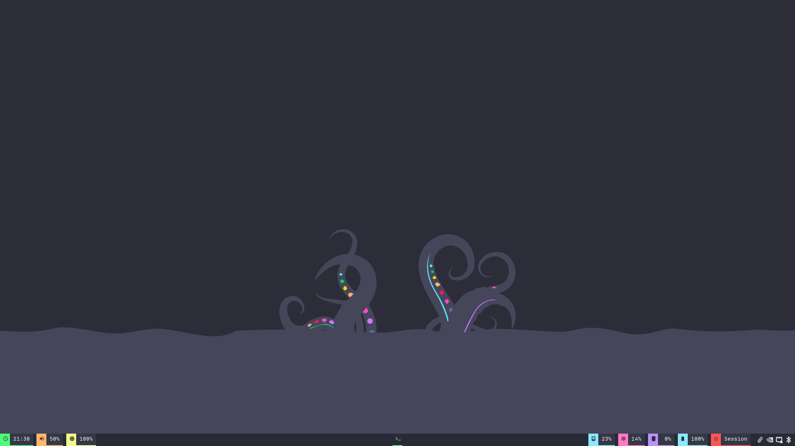
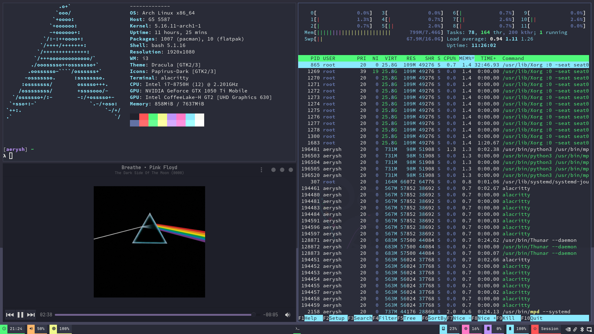
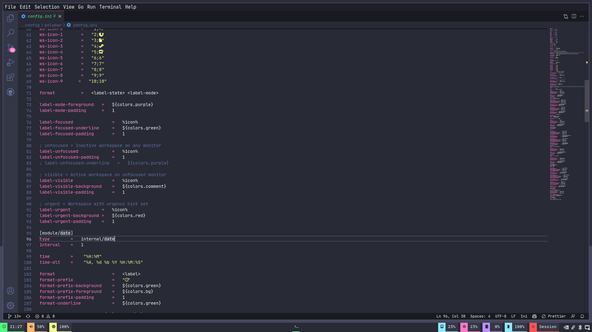

# dotfiles

This is [i3wm](https://i3wm.org) rice based on [Dracula](https://draculatheme.com/) color scheme

to see the [swaywm](https://swaywm.org/) version please check the [main](https://github.com/Aerysh/dotfiles/tree/main) branch of this repository

## Information

Status Bar  :   [polybar](https://polybar.github.io/)

Application Launcher    :   [rofi](https://github.com/davatorium/rofi)

Notification Daemon :   [Dunst](https://dunst-project.org/)

Terminal Emulator   :   [Alacritty](https://alacritty.org)

Compositor  :   [picom](https://github.com/yshui/picom)

Wallpaper   :   [dracula-wallpapers](https://github.com/aynp/dracula-wallpapers)

Fonts   :   [Nerd Fonts JetBrainsMono](https://github.com/ryanoasis/nerd-fonts/releases/download/v2.1.0/JetBrainsMono.zip)

Icon theme  :   [papirus-icon-theme](https://github.com/PapirusDevelopmentTeam/papirus-icon-theme)

GTK / QT Theme  :   [Dracula GTK](https://draculatheme.com/gtk) / [Dracula QT](https://draculatheme.com/qt5)

## Screenshots

